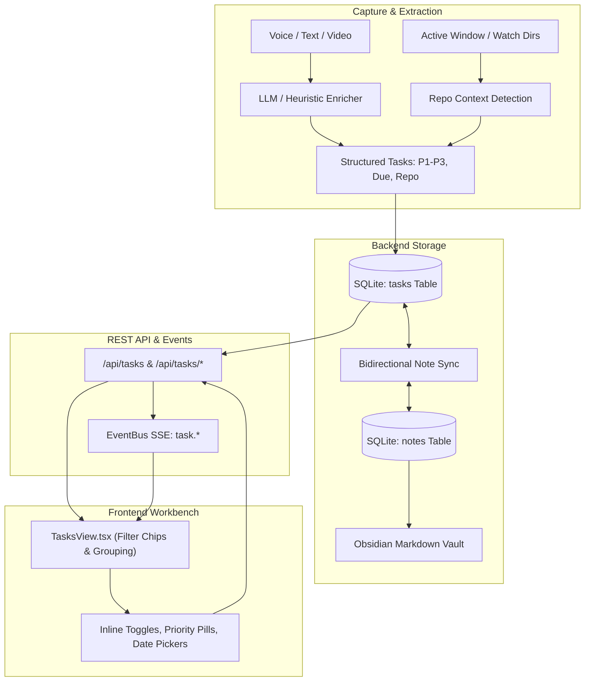

# Sub-Project 2: Action Items & Task Management Evolution Specification

**Status:** Approved  
**Date:** 2026-10-01  
**Target:** Fleeting v0.3.0  
**Scope:** Priority assignment (P1–P3), Due dates, Repository tagging, Dedicated `tasks` relational table, Atomic task REST APIs, Multi-facet filtering, and Interactive Task Workbench.

---

## 1. Executive Summary & Goals

Fleeting automatically extracts action items from messy voice transcripts, text snippets, and YouTube videos. However, tasks have historically been treated as simple strings in an embedded JSON list inside the parent note (`notes.action_items`), lacking critical metadata such as priority level, deadlines, and project context.

This specification details **Sub-Project 2**, evolving Fleeting's task management into a first-class developer-oriented task system:
1. **Dedicated Relational Persistence:** A first-class `tasks` SQLite table with indexing on priority, status, due dates, and repositories, with automatic non-destructive backfill and bidirectional serialization to `notes.action_items` for Obsidian Markdown vault compatibility.
2. **Intelligent Hybrid Enrichment:** Automatic extraction of priorities (`P1`, `P2`, `P3`), due dates (`YYYY-MM-DD`), and repository tags from natural language during capture (using local LLM or offline heuristics), enriched with active window repo context from `watch_dirs`.
3. **Atomic REST APIs:** Direct endpoints for querying, single-tap toggling, patching, and creating tasks without rewriting full note documents.
4. **Enhanced Task Workbench UI:** A redesigned `TasksView.tsx` with multi-facet filter chips, flexible grouping modes (Stream, By Priority, By Note), direct-manipulation priority/date popovers, inline editing, and quick task creation.

---

## 2. Architecture & Data Flow



---

## 3. Database Schema & Migration

### 3.1 Relational `tasks` Table
Defined in `backend/fleeting/db.py`:

```sql
CREATE TABLE IF NOT EXISTS tasks (
    id TEXT PRIMARY KEY,
    note_id TEXT NOT NULL REFERENCES notes(id) ON DELETE CASCADE,
    text TEXT NOT NULL,
    done INTEGER NOT NULL DEFAULT 0,
    priority TEXT NOT NULL DEFAULT 'P2',  -- 'P1' (Urgent), 'P2' (Normal), 'P3' (Low)
    due_date TEXT,                       -- 'YYYY-MM-DD' or NULL
    repo TEXT,                           -- Repository identifier (e.g. 'fleeting') or NULL
    created_at TEXT NOT NULL,
    completed_at TEXT                    -- ISO timestamp when marked done, or NULL
);

CREATE INDEX IF NOT EXISTS idx_tasks_note_id ON tasks(note_id);
CREATE INDEX IF NOT EXISTS idx_tasks_done ON tasks(done);
CREATE INDEX IF NOT EXISTS idx_tasks_priority ON tasks(priority);
CREATE INDEX IF NOT EXISTS idx_tasks_due_date ON tasks(due_date);
CREATE INDEX IF NOT EXISTS idx_tasks_repo ON tasks(repo);
```

### 3.2 Idempotent One-Time Migration
When `Database.__init__` runs:
1. Check if the `tasks` table exists. If newly created or on database startup, run backfill:
   ```python
   rows = self.execute("SELECT id, action_items, created_at, updated_at, source FROM notes WHERE archived = 0").fetchall()
   for row in rows:
       items = json.loads(row["action_items"] or "[]")
       for it in items:
           task_id = it.get("id") or new_id()
           # ensure unique composite key if id is generic like 't1'
           full_id = f"{row['id']}_{task_id}" if not task_id.startswith(f"{row['id']}_") else task_id
           self.execute(
               """
               INSERT OR IGNORE INTO tasks (id, note_id, text, done, priority, due_date, repo, created_at, completed_at)
               VALUES (:id, :note_id, :text, :done, :priority, :due_date, :repo, :created_at, :completed_at)
               """,
               {
                   "id": full_id,
                   "note_id": row["id"],
                   "text": it.get("text", "").strip(),
                   "done": 1 if it.get("done") else 0,
                   "priority": it.get("priority") or "P2",
                   "due_date": it.get("due_date"),
                   "repo": it.get("repo"),
                   "created_at": row["created_at"],
                   "completed_at": row["updated_at"] if it.get("done") else None,
               }
           )
   ```
2. Existing tasks are preserved with 100% fidelity.

### 3.3 Note Synchronization Hook
To preserve full compatibility with note drawers, searches, and Markdown vault exports (`backend/fleeting/services/markdown.py`):
- Whenever a task is created, updated, or deleted, a helper method `_sync_note_action_items(db, note_id)` queries all active tasks for `note_id` ordered by `created_at ASC`.
- The tasks are mapped to a list of dicts:
  ```python
  [
      {
          "id": task["id"],
          "text": task["text"],
          "done": bool(task["done"]),
          "priority": task["priority"],
          "due_date": task["due_date"],
          "repo": task["repo"],
          "completed_at": task["completed_at"],
      },
      ...
  ]
  ```
- The parent note's `action_items` column in `notes` is updated with the JSON string, and if synced with the vault, `markdown.sync_note(...)` is invoked.

---

## 4. Task Extraction, Enrichment & Repo Detection

### 4.1 LLM Structured Extraction Schema
In `backend/fleeting/services/llm.py`, `ENRICH_SCHEMA` is updated:

```python
ENRICH_SCHEMA = {
    "type": "object",
    "properties": {
        "title": {"type": "string"},
        "summary": {"type": "string"},
        "tags": {"type": "array", "items": {"type": "string"}},
        "action_items": {
            "type": "array",
            "items": {
                "type": "object",
                "properties": {
                    "text": {"type": "string"},
                    "priority": {"type": "string", "enum": ["P1", "P2", "P3"]},
                    "due_date": {"type": "string"},
                    "repo": {"type": "string"},
                },
                "required": ["text"],
            },
        },
    },
    "required": ["title", "summary", "tags", "action_items"],
}
```

The system prompt is augmented with current temporal context:
- `"Today's date is {today_iso}. Extract any action items as imperative statements. For priority: 'P1' for urgent/blocker/asap/critical, 'P3' for low priority/someday/eventual, 'P2' for normal. For due_date: format as 'YYYY-MM-DD' if stated or implied (e.g. 'tomorrow', 'by friday'); otherwise null. For repo: project or codebase name if referenced (e.g. 'fleeting', 'dotfiles'); otherwise null."`

### 4.2 Offline Heuristic Fallback (`heuristic_enrich`)
In `backend/fleeting/services/llm.py`, regex rules mine tasks when running offline:
- **Priority:** Matches against `\b(p1|urgent|critical|asap|blocker|immediately)\b` $\to$ `P1`; `\b(p3|someday|eventually|low[- ]priority)\b` $\to$ `P3`; default $\to$ `P2`.
- **Due Date:** Matches against `\b(?:by|due|before|on)\s+(tomorrow|today|monday|tuesday|wednesday|thursday|friday|saturday|sunday|\d{4}-\d{2}-\d{2})\b`. Relative days are converted using `datetime.date.today()`.
- **Repo:** Matches against `\b(?:in|for|repo:)\s+([a-zA-Z0-9_-]+)(?:\s+repo)?\b` or `#([a-zA-Z0-9_-]+)`.

### 4.3 Git Repository Discovery (`backend/fleeting/services/repos.py`)
A new lightweight service discovers known repositories across configured `watch_dirs`:
- Scans paths like `~/Projects/*`, `~/Documents/*` for `.git` directories.
- Returns list of `{ "name": "fleeting", "path": "/home/nikhil/Projects/fleeting" }`.
- When quick capture runs from an active window whose title or process cwd matches a known git repository, that repository name is automatically assigned to the capture's default task context.

---

## 5. REST API Specification

A dedicated router at `backend/fleeting/routers/tasks.py` (`/api/tasks`):

| Endpoint | Method | Description |
|---|---|---|
| `/api/tasks` | `GET` | List & filter tasks. Query params: `status` (`open`\|`done`\|`all`), `priority` (`P1`\|`P2`\|`P3`), `repo` (str), `due` (`overdue`\|`today`\|`week`\|`nodate`), `q` (str), `limit`, `offset`. |
| `/api/tasks` | `POST` | Create a standalone action item. Body: `{ text, priority?, due_date?, repo?, note_id? }`. |
| `/api/tasks/{id}` | `PATCH` | Update task fields. Body: `{ text?, done?, priority?, due_date?, repo? }`. |
| `/api/tasks/{id}/toggle` | `POST` | Toggle completion status (`done: 0 <-> 1`, sets `completed_at` to now or null). |
| `/api/tasks/{id}` | `DELETE` | Delete task row and remove from note. |
| `/api/tasks/repos` | `GET` | Get distinct repo tags with task counts and paths from `watch_dirs`. |
| `/api/tasks/stats` | `GET` | Get task analytics (open, done, overdue, completion rate, counts by priority). |

### EventBus Broadcasts
- `task.created` $\to$ `{ task: TaskOut }`
- `task.updated` $\to$ `{ task: TaskOut }`
- `task.deleted` $\to$ `{ id: str, note_id: str }`

---

## 6. Frontend Task Workbench (`TasksView.tsx`)

### 6.1 Type Definitions (`frontend/src/types.ts`)
```typescript
export type TaskPriority = "P1" | "P2" | "P3";

export interface TaskItem {
  id: string;
  note_id: string;
  note_title?: string;
  text: string;
  done: boolean;
  priority: TaskPriority;
  due_date: string | null;      // 'YYYY-MM-DD'
  repo: string | null;          // 'fleeting'
  created_at: string;
  completed_at: string | null;
}

export interface TaskStats {
  open: number;
  done: number;
  total: number;
  completion_rate: number;
  by_priority: {
    P1: number;
    P2: number;
    P3: number;
  };
  overdue: number;
  due_today: number;
}
```

### 6.2 Filter Toolbar & Chips
- **Status Filter:** `Open`, `Completed`, `All`.
- **Priority Filter Chips:**
  - `All` | `P1` (coral badge) | `P2` (amber badge) | `P3` (slate/sky badge).
- **Due Date Filter Chips:**
  - `All Dates` | `Overdue` (accented red alert pill) | `Today` | `This Week`.
- **Repo Dropdown:**
  - Shows active repositories with item counts (e.g. `fleeting (6)`, `dotfiles (2)`).
- **Search Bar:** Real-time client-side filter by text or source note title.

### 6.3 Grouping Modes
- **Stream:** Prioritized linear feed (sorted by priority P1 $\to$ P2 $\to$ P3, then earliest due date, then `created_at`).
- **By Priority:** Three visual column bands:
  - `P1 — Urgent & Blockers`
  - `P2 — Normal / In Progress`
  - `P3 — Backlog & Someday`
- **By Note:** Grouped cards by source capture note with note-level progress rings.

### 6.4 Interactive Task Row Controls
- **Direct Checkbox:** Optimistic toggle calling `POST /api/tasks/{id}/toggle`.
- **Interactive Priority Pill:** Clicking cycles `P1 -> P2 -> P3 -> P1` or reveals a mini-popover to pick directly.
- **Due Date Indicator:** Relative pill (`Today`, `Tomorrow`, `Overdue by 2d`, or `Oct 14`). Clicking reveals quick options (`Today`, `Tomorrow`, `Next Monday`, `Pick Date`, `Clear`).
- **Repo Badge:** Clickable badge to filter by that repo or reassign repository.
- **Inline Text Editing:** Double-click or click pencil to edit text inline with `Enter` commit.
- **Source Note Link:** Opens note drawer for full audio/transcript/summary context.

---

## 7. Testing & Verification Plan

1. **Backend Tests (`backend/tests/test_tasks.py`):**
   - Test `tasks` table creation and backfill migration from existing notes.
   - Test task CRUD and toggle endpoints (`/api/tasks`, `/api/tasks/{id}/toggle`, `PATCH`, `DELETE`).
   - Test filtering by priority (`P1`), status (`open`/`done`), due date, and repo.
   - Test bidirectional synchronization with `notes.action_items` and markdown vault sync.
   - Test LLM enrichment parsing and `heuristic_enrich` priority/date/repo extraction.
2. **Frontend Tests (`frontend/src/components/__tests__/TasksView.test.tsx`):**
   - Test rendering tasks with priorities P1–P3, due dates, and repo badges.
   - Test toggling status, priority cycling, and due date selection.
   - Test filtering by priority chips and repo dropdown.
   - Test grouping modes (Stream, By Priority, By Note).
3. **Build & Regression Verification:**
   - Run `uv run pytest` across all existing 48 tests + new task tests.
   - Run `npm test` and `npm run build` in `frontend/`.
