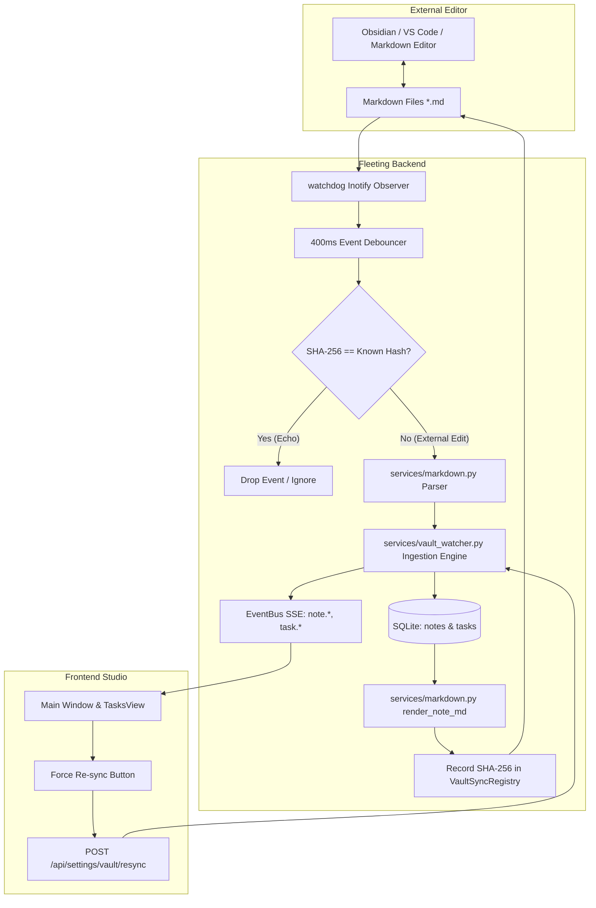

# Sub-Project 3: Obsidian & Markdown Vault 2-Way Sync Specification

**Status:** Approved  
**Date:** 2026-10-02  
**Target:** Fleeting v0.3.0  
**Scope:** Real-time bidirectional synchronization between Fleeting's SQLite database and Obsidian/Markdown vault directories, task checkbox sync, frontmatter & body sync, new markdown file ingestion, and echo suppression.

---

## 1. Executive Summary & Goals

Fleeting previously offered a one-way mirror from SQLite to a Markdown vault directory. If a user edited notes in Obsidian—checking off action items (`- [x]`), refining titles, editing tags, or creating new Markdown files—those updates remained invisible to Fleeting.

This specification details **Sub-Project 3**, establishing full **two-way live synchronization**:
1. **Real-Time Inotify Watcher:** A background service using Python's `watchdog` monitoring the configured `vault_dir` with a 400ms debounce window.
2. **Content-Addressed Echo Suppression:** A thread-safe `VaultSyncRegistry` tracking SHA-256 content hashes to eliminate infinite write feedback loops when Fleeting writes notes to disk.
3. **Smart Markdown & Frontmatter Parser:** Bidirectional serialization and parsing of YAML frontmatter, `# Heading` titles, `## Action items` checklists with priority (`[P1]`), due date (`[due:YYYY-MM-DD]`), and repo (`[repo:name]`) tags, and note content.
4. **Task & Note Ingestion:** Updates task completion states, priority, deadlines, note titles, and tags in SQLite, broadcasting live SSE events to all connected clients.
5. **New Note Ingestion:** Auto-imports untracked Markdown files created directly in the vault, assigning a Fleeting note ID and updating frontmatter.
6. **Settings & Reconciliation:** A "Force Vault Re-sync" button and endpoint (`POST /api/settings/vault/resync`) with a live status indicator pill in `SettingsView.tsx`.

---

## 2. Architecture & Data Flow



---

## 3. Real-Time Watcher & Echo Suppression Engine

### 3.1 Observer Service (`backend/fleeting/services/vault_watcher.py`)
- Uses `watchdog.observers.Observer` to watch `cfg.paths.vault_dir` recursively.
- Ignores hidden files (`.*`), non-markdown files, and temporary editor swap files (`*.tmp`, `*.swp`).
- Runs as an in-process thread initialized during FastAPI lifespan in `backend/fleeting/main.py`.

### 3.2 Thread-Safe `VaultSyncRegistry`
```python
class VaultSyncRegistry:
    def __init__(self):
        self._hashes: dict[str, tuple[str, float]] = {}  # abs_path -> (sha256, timestamp)
        self._lock = threading.Lock()

    def register(self, path: Path, content: str) -> None:
        h = hashlib.sha256(content.encode("utf-8")).hexdigest()
        with self._lock:
            self._hashes[str(path.resolve())] = (h, time.monotonic())

    def is_echo(self, path: Path, content: str) -> bool:
        h = hashlib.sha256(content.encode("utf-8")).hexdigest()
        with self._lock:
            known = self._hashes.get(str(path.resolve()))
            if not known:
                return False
            known_hash, reg_time = known
            # Valid echo if hash matches and occurred within last 10 seconds
            if known_hash == h and (time.monotonic() - reg_time) < 10.0:
                return True
            return False
```

### 3.3 Event Debouncing
- Because text editors often emit rapid write sequences (e.g. truncate $\to$ write $\to$ flush $\to$ chmod or write-temp $\to$ rename), events are buffered per file path for 400ms before processing.

---

## 4. Markdown & Frontmatter Bidirectional Parser

### 4.1 Serialization (`render_note_md`)
Extends `backend/fleeting/services/markdown.py`:
- Injects YAML frontmatter with `id`, `type`, `created`, `app: fleeting`, and `tags`.
- Serializes checklist items under `## Action items` incorporating metadata tags:
  ```markdown
  ## Action items
  - [x] Fix responsive navigation layout [P1] [repo:fleeting]
  - [ ] Add due date picker to tasks view [due:2026-10-05]
  ```
- Priority tag: `[P1]`, `[P2]`, or `[P3]`.
- Due date tag: `[due:YYYY-MM-DD]`.
- Repo tag: `[repo:name]`.

### 4.2 Parsing (`parse_note_md`)
Extracts structured components from raw Markdown strings:
- **YAML Frontmatter:** Parses key-value pairs (`id`, `tags`, `type`, `created`, `source`).
- **Title:** First `# Heading` line.
- **Summary:** Paragraphs preceding the first sub-heading.
- **Action items:**
  - Regex: `r"^[ \t]*-[ \t]*\[([ xX])\][ \t]+(.*)$"`.
  - Determines `done: bool` (`True` if `x` or `X`).
  - Mines and extracts `\[P([123])\]`, `\[due:(\d{4}-\d{2}-\d{2})\]`, and `\[repo:([a-zA-Z0-9_-]+)\]`.
  - Cleans metadata tags from `text` so the task text remains human-readable.
- **Content:** Text under `## Content` or `## Transcript`.

---

## 5. Database & Task Ingestion Engine

When a non-echo file event occurs:

### 5.1 Existing Notes (Frontmatter contains `id`)
1. Lookup note in SQLite via `db.get_note(note_id)`. If missing, route to New Note ingestion.
2. Compare and update note attributes (`title`, `tags`, `raw_text`, `summary`) via `db.update_note(note_id, changes)`.
3. Reconcile tasks:
   - Query existing tasks for `note_id` from `tasks` table.
   - For each checklist item in Markdown:
     - Match with existing tasks by task ID or normalized text.
     - If matched:
       - Update `done` flag. If changed to `True`, set `completed_at = now_iso()`; if unchecked, set `completed_at = None`.
       - Update `priority`, `due_date`, and `repo` if tags were changed in Markdown.
     - If new checklist item found:
       - Insert into `tasks` table (`db.insert_task`).
   - If an existing task was removed from Markdown:
     - Delete from `tasks` table (`db.delete_task`).
   - Sync parent note's `action_items` column in SQLite (`db._sync_note_action_items(note_id)`).
4. Broadcast live updates on `EventBus`: `note.updated` and `task.updated`.

### 5.2 Untracked New Notes (No `id` in frontmatter)
1. User dropped or wrote a new `.md` file in the vault.
2. Create note in SQLite: `type = "text"`, `status = "done"`, title from `# Heading` or file stem, content from body, tags from frontmatter.
3. Parse and insert action items into `tasks` table.
4. Rewrite file with YAML frontmatter containing the new `id: ...`, registering the resulting SHA-256 in `VaultSyncRegistry` so the write does not re-trigger.
5. Broadcast `note.created` and `task.created`.

### 5.3 Deleted Files
- If an exported note file is deleted in the vault, mark `archived = 1` in SQLite rather than permanently dropping data, preserving user history while keeping the active inbox uncluttered.

---

## 6. Settings, API & UI Controls

### 6.1 Backend API Endpoint
- **`POST /api/settings/vault/resync`**:
  - Traverses `cfg.paths.vault_dir` recursively.
  - Reconciles all Markdown files against SQLite notes and tasks.
  - Returns:
    ```json
    {
      "ok": true,
      "synced_notes": 24,
      "imported_notes": 3,
      "tasks_updated": 8
    }
    ```

### 6.2 Settings View Enhancements (`frontend/src/components/SettingsView.tsx`)
- Status pill:
  - 🟢 `Watching Vault (/home/.../Obsidian)`
  - ⚪ `Sync Disabled`
- On-demand button: `Force Vault Re-sync` with progress indicator and toast notifications.

---

## 7. Testing & Verification Strategy

1. **Unit Tests (`backend/tests/test_markdown_parser.py`):**
   - Test `render_note_md` and `parse_note_md` roundtrips (frontmatter, title, checklist items with `[P1]`, `[due:...]`, `[repo:...]`, and content).
   - Test parsing varied markdown formats (uppercase `[X]`, indented checklists, multiline summaries).
2. **Watcher & Ingestion Tests (`backend/tests/test_vault_sync.py`):**
   - Test `VaultSyncRegistry` echo detection and expiration.
   - Test external modification of a note file updating SQLite note title, tags, and tasks.
   - Test toggling a checklist item in Markdown updating task `done` and `completed_at`.
   - Test adding a new task in Markdown creating a task row in SQLite.
   - Test importing a new untracked Markdown file creating a note and writing frontmatter.
   - Test `POST /api/settings/vault/resync`.
3. **Frontend & Regression Verification:**
   - Run `uv run pytest` (100% backend test pass rate).
   - Run `npm test` and `npm run build` in `frontend/`.
